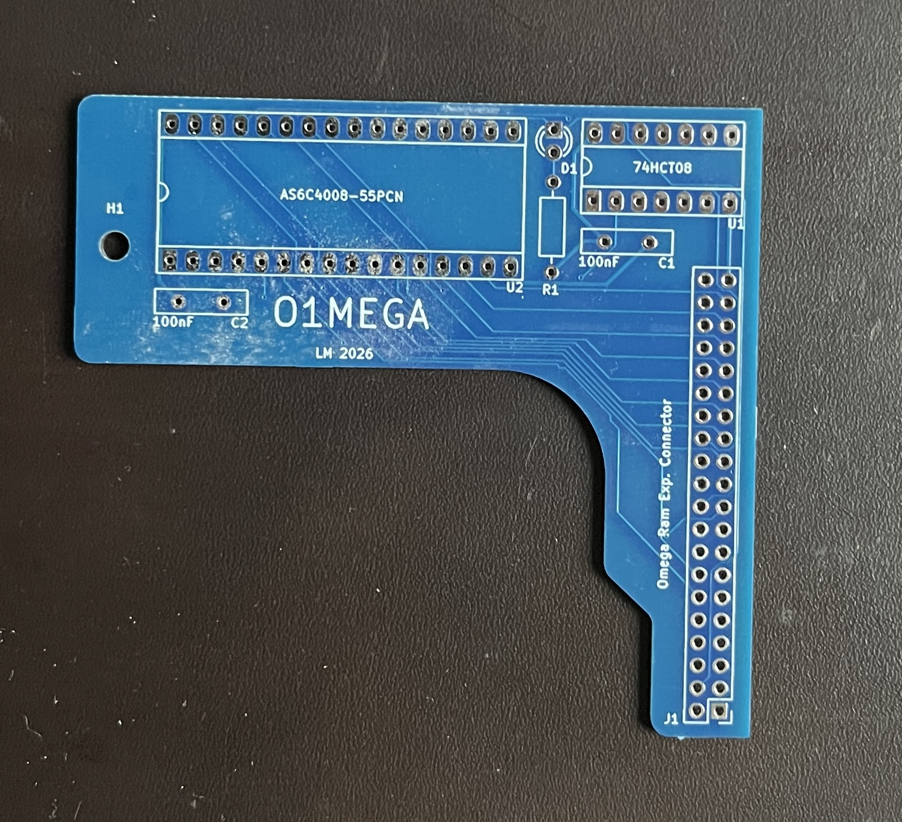
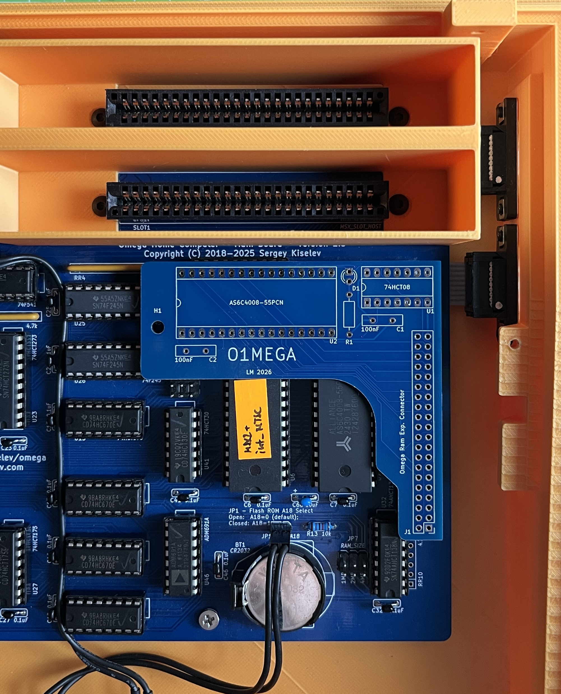

# O1MEGA for Omega MSX  
Space optimized PCB for additional 512KB Ram for the Omega MSX Computer.  
The PCB is based on the [o4mega](https://github.com/msx-solis/o4Mega_v3.2) Board from MSXmakers.  
  
[Schematics](KiCad/o1mega_THT_Schematics.pdf)  
[Gerber ZIP File](KiCad/Gerber.zip)  

  
  
  

